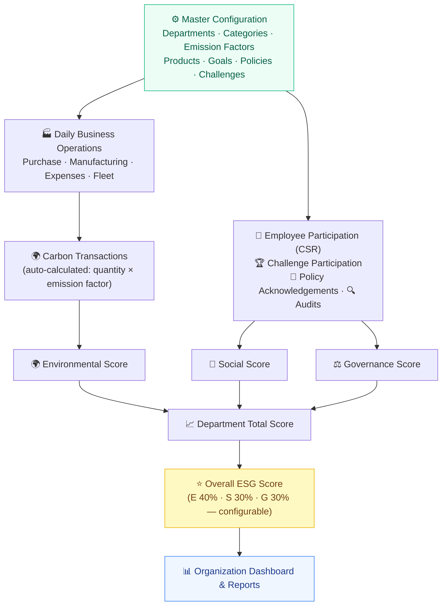

# 🌱 EcoSphere — ESG Management Platform

> **Simple explanation:** EcoSphere is a platform that tracks a company's **Environmental (carbon)**, **Social (community + employees)**, and **Governance (rules + audits)** performance — all in one place. It pulls data from everyday business operations, motivates employees toward sustainability through **games and rewards**, and gives management a clean **ESG score, dashboard, and reports**.

**In one line:** _Measure → Manage → Improve_ your company's Environmental, Social & Governance performance — all in one dashboard.

---

## 🧩 What it does

- 🌍 **Environmental** — Calculate carbon emissions from daily operations (purchase, manufacturing, fleet…)
- 🤝 **Social** — Organize CSR activities, track employee participation, monitor diversity/training metrics
- ⚖️ **Governance** — Manage policies, audits, and compliance issues
- 🏆 **Gamification** — Engage employees with challenges, XP, badges, rewards, and leaderboards
- ⭐ **Scoring** — All data rolls up into an **Overall ESG Score** (weighted: E 40% / S 30% / G 30%)
- 📊 **Reports & Dashboard** — Everything in one place, tailored by role (Admin / Manager / Employee)

---

## 🔄 How it works — Workflow Diagram



**Understanding the flow:** First, an admin sets up the **master config** → then **daily operations** happen → these generate **carbon** and **participation** data → which convert into **E / S / G scores** → the three combine into a **Department Score** → all departments roll up into the **Overall ESG Score** → shown in the **Dashboard & Reports**.

---

## 👥 Roles at a glance

| Role | What they do |
|------|--------------|
| 👑 **Admin** | Full access — configures master data, settings, users, everything |
| 👔 **Manager** | Creates activities/challenges, approves participations, views department reports |
| 👤 **Employee** | Joins challenges/CSR, submits proof, earns XP/points, redeems rewards |

> 📚 Detailed guide for each module is in the `docs/` folder:
> [Environmental](docs/1-environmental.md) · [Social](docs/2-social.md) · [Governance](docs/3-governance.md) · [Gamification](docs/4-gamification.md)

---

## 🗄️ What kind of data do we have?

The database is split into two kinds of data:

- **Master Data** — stable reference/setup info you configure once and reuse everywhere (like a dictionary).
- **Transactional Data** — the day-to-day activity that keeps happening and points back to master data (like an activity log).

> **Analogy:** Master data is the *menu and price list* of a restaurant; transactional data is every *order* placed using that menu.

### 📦 Master Data (setup / reference)

| Model | What it stores (plain language) | Key fields |
|-------|--------------------------------|------------|
| **Department** | Company teams and their ESG ownership | name, code, head, parent department, employeeCount, status |
| **User** | Every person (Admin / Manager / Employee) | name, email, passwordHash, role, department, **xp**, **points**, status |
| **Category** | Reusable labels shared by Social & Gamification | name, type (`CSR_ACTIVITY` / `CHALLENGE`), status |
| **EmissionFactor** | Conversion numbers for carbon maths | name, source, unit, **factor** (kgCO₂ per unit), status |
| **ProductESGProfile** | ESG info attached to a product | productName, category, carbonPerUnit, recyclablePct, notes |
| **EnvironmentalGoal** | Sustainability targets to track | title, targetValue, currentValue, unit, deadline, department, status |
| **ESGPolicy** | Governance rules employees must acknowledge | title, description, version, effectiveDate, status |
| **Badge** | Achievements that auto-unlock | name, description, **unlockRule** (`XP_THRESHOLD` / `CHALLENGE_COUNT`), threshold, icon |
| **Reward** | Prizes redeemable with points | name, description, **pointsRequired**, **stock**, status |
| **Setting** | Single-row platform config | autoEmission, evidenceRequired, badgeAutoAward, weightEnv/Social/Gov |

### 🔄 Transactional Data (day-to-day activity)

| Model | What it records (plain language) | Key fields |
|-------|----------------------------------|------------|
| **OperationalRecord** | A business activity that produces carbon | type (`PURCHASE`/`MANUFACTURING`/`EXPENSE`/`FLEET`), quantity, unit, emissionFactor, department, user |
| **CarbonTransaction** | The calculated CO₂ for an activity | emissions (kgCO₂), department, linked operational record |
| **CsrActivity** | A social/community event the company runs | title, location, dates, maxParticipants, xpReward, pointsReward, department |
| **Participation** | An employee joining a CSR activity | user, activity, proof, **status** (PENDING/APPROVED/REJECTED), xpAwarded, pointsAwarded |
| **SocialMetric** | HR/diversity data per department per period | period, totalEmployees, femaleCount, trainingHours, safetyIncidents, volunteerHours |
| **PolicyAcknowledgement** | An employee accepting a policy | policy, user, acknowledgedAt |
| **Audit** | A governance/compliance audit report | title, auditor, auditDate, rating, score, findings, department |
| **ComplianceIssue** | A rule violation to fix | title, severity, status, **dueDate**, **owner**, department (auto-flagged *overdue*) |
| **Challenge** | A gamified sustainability task | title, dates, xpReward, pointsReward, **status** (Draft→Active→Under Review→Completed/Archived) |
| **ChallengeParticipation** | An employee's challenge submission | challenge, user, proof, status |
| **UserBadge** | A badge unlocked by an employee | user, badge, unlockedAt |
| **RewardRedemption** | Points spent to claim a reward | user, reward, pointsSpent, redeemedAt |
| **Notification** | An in-app alert to a user | type, title, message, isRead, link |

### 🔗 How the data connects

```
Master config (Departments, Emission Factors, Policies, Badges, Rewards…)
        │  is referenced by
        ▼
Transactional activity (Operational Records, CSR Participation, Challenges, Audits…)
        │  rolls up into
        ▼
Scores & analytics (Carbon Transactions → E/S/G scores → Overall ESG Score)
        │  shown on
        ▼
Dashboards, Leaderboards & Reports
```

- An **Operational Record** references an **Emission Factor** → generates a **Carbon Transaction** (`emissions = quantity × factor`).
- A **Participation** / **ChallengeParticipation** references a **User** + activity → on approval, awards **XP & points** (updating the User) → may auto-unlock a **UserBadge**.
- A **RewardRedemption** deducts a User's points and reduces a **Reward**'s stock.
- **SocialMetric**, **Audit**, and **ComplianceIssue** feed the Social & Governance dashboards and department ESG scores.

---

## 🛠️ Tech Stack

- **Backend:** Node.js + Express + TypeScript + Prisma ORM
- **Database:** PostgreSQL (via Docker)
- **Frontend:** React + Vite + TypeScript + Tailwind CSS + Recharts + Lucide icons
- **Auth:** JWT + bcrypt with role-based access control (RBAC)

---

## ✅ Modules Built

| Phase | Module | Status |
|-------|--------|--------|
| 1 | Auth & RBAC, Master Data CRUD, Settings | ✅ |
| 2 | Environmental (carbon accounting) | ✅ |
| 3 | Social (CSR + participation) | ✅ |
| 4 | Governance (policies, audits, compliance) | ✅ |
| 5 | Gamification (challenges, badges, rewards) | ✅ |
| 6 | ESG Scoring Engine | ✅ |
| 7 | Reports | ✅ |
| 8 | Notifications & Dashboards | ✅ |

---

## 🚀 Getting Started

**1. Database (PostgreSQL via Docker)**
```bash
docker start ecosphere-pg
# first time only:
# docker run --name ecosphere-pg -e POSTGRES_USER=ecosphere \
#   -e POSTGRES_PASSWORD=ecosphere -e POSTGRES_DB=ecosphere \
#   -p 5433:5432 -d postgres:16-alpine
```

**2. Backend** (terminal 1)
```bash
cd server
npm install
npx prisma migrate dev
npm run seed
npm run dev          # → http://localhost:4000
```

**3. Frontend** (terminal 2)
```bash
cd client
npm install
npm run dev          # → http://localhost:5173
```

---

## 🔑 Default Seeded Accounts

| Role     | Email                    | Password    |
|----------|--------------------------|-------------|
| Admin    | admin@ecosphere.local    | Admin@123   |
| Manager  | manager@ecosphere.local  | Manager@123 |
| Employee | employee@ecosphere.local | Employee@123|

---

## 🌿 Git Workflow

- `main` — stable / demo-ready
- `develop` — integration branch
- `feature/*` — per-feature work (feature/auth, feature/master-data, …)
